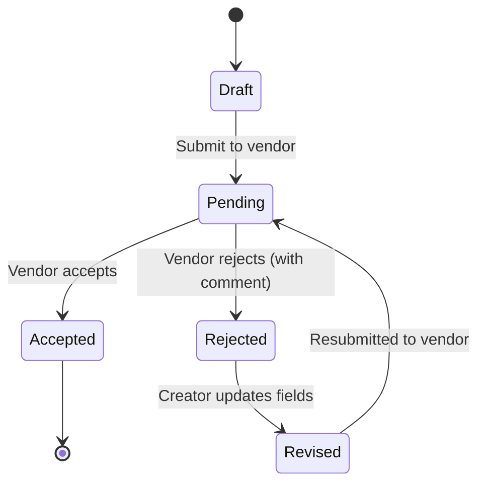

# Domain Vocabulary

## Entities & Aggregates

| Term | Definition | Bounded Context |
|------|-----------|-----------------|
| Purchase Order | A buyer's formal request to a vendor for goods. Contains header, trade details, and one or more line items. Aggregate root. | Procurement |
| Line Item | A single product/material entry on a PO: part number, description, quantity, UoM, unit price, HS code, country of origin. Child entity of Purchase Order. | Procurement |
| Vendor | The supplier fulfilling a purchase order. Separate entity with id (UUID), name, country, and active/inactive status. PO references vendor by id; name and country resolved on read. | Procurement |
| Buyer | The purchasing party on a PO. Stored inline as buyer_name and buyer_country. Prefilled with a default value on creation. | Procurement |
| Vendor Status | Active or Inactive. Only Active vendors can be assigned to new POs. Deactivation does not affect existing POs. | Procurement |
| Vendor Reactivation | Restoring an Inactive vendor to Active status. Symmetric guard to deactivation: must be INACTIVE. | Procurement |
| Reference Data | System-managed, immutable value lists (currencies, incoterms, payment terms, countries, ports) that constrain PO fields. Served via API; frontend renders as dropdowns. | Procurement |
| USD Exchange Rate | Static indicative rate converting a currency to USD, stored in reference data as `(currency_code, rate)` pairs. Used for approximate dashboard totals, not financial calculations. | Procurement |
| Rejection Record | A timestamped comment captured when a vendor rejects a PO. Append-only; accumulated across reject/revise cycles. Value object owned by Purchase Order. | Procurement |

## PO Header Fields

| Term | Definition | Bounded Context |
|------|-----------|-----------------|
| PO Number | Unique system-generated identifier for a purchase order. Format: `PO-YYYYMMDD-XXXX`, sequential per day. | Procurement |
| Ship-to Address | The physical delivery address for the goods. | Procurement |
| Payment Terms | How and when payment is made (LC, TT, DA, DP). | Procurement |
| Currency | The currency in which the PO is denominated. | Procurement |
| Issued Date | Date the PO was formally issued. | Procurement |
| Required Delivery Date | Date by which goods must be delivered. | Procurement |
| Total Value | Sum of all line item values on the PO. | Procurement |
| Terms and Conditions | Full text of the legal terms governing the PO. | Procurement |

## Trade Fields

| Term | Definition | Bounded Context |
|------|-----------|-----------------|
| Incoterm | International commercial term defining delivery obligations (FOB, CIF, EXW, etc.). | Trade |
| Port of Loading | The port where goods are loaded onto the export carrier. | Trade |
| Port of Discharge | The port where goods are unloaded at destination. | Trade |
| Country of Origin | The country where goods were manufactured or produced. Applies at PO header and per line item. | Trade |
| Country of Destination | The country where goods are ultimately delivered. | Trade |

## Line Item Fields

| Term | Definition | Bounded Context |
|------|-----------|-----------------|
| Part Number | Identifier for the product or material. | Procurement |
| Unit of Measure | The measurement unit for a line item quantity (e.g., pcs, kg, m). | Procurement |
| HS Code | Harmonized System tariff classification code for a product. Used for customs declarations. | Trade |

## Document Export

| Term | Definition | Bounded Context |
|------|-----------|-----------------|
| Reference Label | The human-readable form of a reference data code, resolved via lookup. Port labels combine city and country (e.g. "CNSHA" resolves to "Shanghai, China"). | Procurement |
| PO Document Export | A PDF rendering of a PO as a clean commercial document: header, parties, trade details, line items, terms and conditions. Excludes operational data (rejection history). | Procurement |

## Read Models

| Term | Definition | Bounded Context |
|------|-----------|-----------------|
| Dashboard | Read model aggregating PO counts, USD-equivalent totals by status, vendor health metrics (active/inactive counts), and recent PO activity. Not a domain aggregate. | Procurement |
| Paginated List | A windowed query result containing items, total count, page number, and page size. Backend-enforced to avoid full dataset transfer. | Procurement |
| PO Search | Text-based lookup matching against po_number, vendor_name, and buyer_name. Case-insensitive substring match, server-side. | Procurement |

## Compliance (deferred)

| Term | Definition | Bounded Context |
|------|-----------|-----------------|
| Letter of Credit Number | Reference to the LC issued by the buyer's bank to guarantee payment. | Compliance |
| Export License Number | Government-issued license permitting export of controlled goods. | Compliance |
| Packing List Reference | Pointer to the document detailing how goods are packed for shipment. | Compliance |
| Bill of Lading Reference | Pointer to the carrier-issued document acknowledging receipt of goods for shipment. | Compliance |

## PO Parties

| Term | Definition | Bounded Context |
|------|-----------|-----------------|
| Buyer Name | Name of the purchasing party. Inline on PO, prefilled with default. | Procurement |
| Buyer Country | Country of the purchasing party. Inline on PO, prefilled with default. | Procurement |
| Default Buyer | The system owner's identity (name and country) prefilled on new POs. Currently hardcoded; will become configurable when Buyer is promoted to a first-class entity. | Procurement |

## PO Field Immutability

| Fields | Rule |
|--------|------|
| `id`, `po_number`, `created_at` | Immutable after creation |
| All other fields | Mutable only in Draft and Rejected status |

## PO Lifecycle

| Status | Definition |
|--------|-----------|
| Draft | PO is being composed, not yet visible to vendor. |
| Pending | PO submitted to vendor, awaiting accept or reject. |
| Accepted | Vendor formally accepted. Terminal. |
| Rejected | Vendor rejected with mandatory comment. |
| Revised | Previously rejected PO updated and resubmitted, awaiting vendor action. |

### Status Transitions

| From | To | Trigger |
|------|----|---------|
| Draft | Pending | PO submitted to vendor |
| Pending | Accepted | Vendor accepts |
| Pending | Rejected | Vendor rejects with comment |
| Rejected | Revised | Creator updates PO fields |
| Revised | Pending | Revised PO resubmitted to vendor |

### State Diagram

