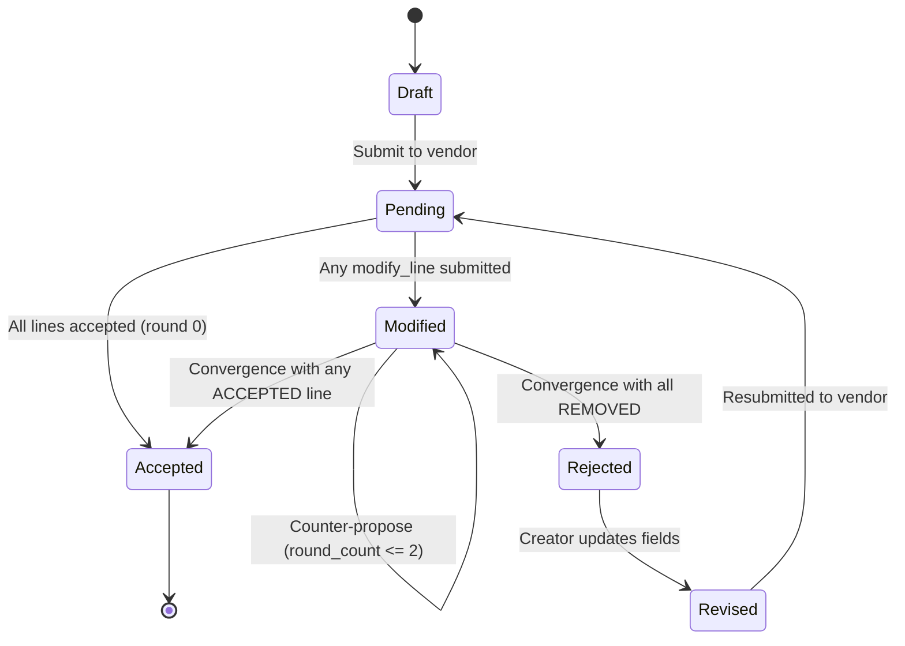

# Domain Vocabulary

## Entities & Aggregates

| Term | Definition | Bounded Context |
|------|-----------|-----------------|
| Purchase Order | A buyer's formal request to a vendor for goods. Contains header, trade details, and one or more line items. Aggregate root. | Procurement |
| Line Item | A single product/material entry on a PO: part number, description, quantity, UoM, unit price, HS code, country of origin. Child entity of Purchase Order. | Procurement |
| Vendor | The supplier fulfilling a purchase order. Separate entity with id (UUID), name, country (validated reference data code), and active/inactive status. PO references vendor by id; name and country resolved on read. | Procurement |
| Buyer | The purchasing party on a PO. Stored inline as buyer_name and buyer_country. Prefilled with a default value on creation. | Procurement |
| Vendor Status | Active or Inactive. Only Active vendors can be assigned to new POs. Deactivation does not affect existing POs. | Procurement |
| Vendor Reactivation | Restoring an Inactive vendor to Active status. Symmetric guard to deactivation: must be INACTIVE. | Procurement |
| Reference Data | System-managed, immutable value lists (currencies, incoterms, payment terms, countries, ports) that constrain PO fields. Served via API; frontend renders as dropdowns. | Procurement |
| USD Exchange Rate | Static indicative rate converting a currency to USD, stored in reference data as `(currency_code, rate)` pairs. Used for approximate dashboard totals, not financial calculations. | Procurement |
| Rejection Record | A timestamped comment captured when a vendor rejects a PO. Append-only; accumulated across reject/revise cycles. Value object owned by Purchase Order. | Procurement |

## PO Header Fields

| Term | Definition | Bounded Context |
|------|-----------|-----------------|
| PO Number | Unique system-generated identifier for a purchase order. Format: `PO-YYYYMMDD-XXXX`, sequential per day. | Procurement |
| Ship-to Address | The physical delivery address for the goods. | Procurement |
| Payment Terms | How and when payment is made. Covers advance (ADV, CIA, COD), net terms (NET15 through NET120), early-payment discount (2NET30), documentary trade (DA, DP, LC, SBLC, TT), and open account (OA, CONSIGN). Validated against reference data. | Procurement |
| Currency | The currency in which the PO is denominated. | Procurement |
| Issued Date | Date the PO was formally issued. | Procurement |
| Required Delivery Date | Date by which goods must be delivered. | Procurement |
| Total Value | Sum of all line item values on the PO. | Procurement |
| Terms and Conditions | Full text of the legal terms governing the PO. | Procurement |

## Trade Fields

| Term | Definition | Bounded Context |
|------|-----------|-----------------|
| Incoterm | International commercial term defining delivery obligations (FOB, CIF, EXW, etc.). | Trade |
| Port of Loading | The port where goods are loaded onto the export carrier. | Trade |
| Port of Discharge | The port where goods are unloaded at destination. | Trade |
| Country of Origin | The country where goods were manufactured or produced. Applies at PO header and per line item. | Trade |
| Country of Destination | The country where goods are ultimately delivered. | Trade |

## Line Item Fields

| Term | Definition | Bounded Context |
|------|-----------|-----------------|
| Part Number | Identifier for the product or material. | Procurement |
| Unit of Measure | The measurement unit for a line item quantity (e.g., pcs, kg, m). | Procurement |
| HS Code | Harmonized System tariff classification code for a product. Used for customs declarations. Format: digits and dots only, minimum 4 characters. Validated on backend (field_validator) and frontend (inline error with submit-disable). | Trade |

## Document Export

| Term | Definition | Bounded Context |
|------|-----------|-----------------|
| Reference Label | The human-readable form of a reference data code, resolved via lookup. Port labels combine city and country (e.g. "CNSHA" resolves to "Shanghai, China"). Resolved server-side for PDF export (`reference_labels.py`) and client-side for detail views (`labels.ts`). | Procurement |
| PO Document Export | A PDF rendering of a PO as a clean commercial document: header, parties, trade details, line items, terms and conditions. Currency stated once in the header; line item amounts are plain numbers. Excludes operational data (rejection history). | Procurement |
| Invoice Document Export | A PDF rendering of an invoice: header (invoice number, status, PO number, currency, payment terms, created date), parties (buyer/vendor), line items table with subtotal. Includes dispute reason section when status is DISPUTED. Same ReportLab layout as PO PDF. | Invoicing |
| Bulk Document Export | Multiple invoices combined into a single PDF with one invoice per page. Requested via POST with a list of invoice IDs; missing IDs are skipped. | Invoicing |

## Read Models

| Term | Definition | Bounded Context |
|------|-----------|-----------------|
| Dashboard | Read model aggregating PO counts, USD-equivalent totals by status, invoice counts and totals by status, vendor health metrics (active/inactive counts), and recent PO activity. Not a domain aggregate. | Procurement |
| Invoice List | Paginated read model listing all invoices with PO and vendor context (po_number, vendor_name). Filterable by status, PO number, vendor name, invoice number, and date range (from/to). Text filters use case-insensitive substring matching. Frontend uses dropdowns for PO#, vendor, and invoice# (populated from available data). Sorted by created_at descending. | Invoicing |
| Paginated List | A windowed query result containing items, total count, page number, and page size. Backend-enforced to avoid full dataset transfer. Used by both PO list and invoice list. | Procurement |
| PO Search | Text-based lookup matching against po_number, vendor_name, and buyer_name. Case-insensitive substring match, server-side. | Procurement |

## Bulk Operations

| Term | Definition | Bounded Context |
|------|-----------|-----------------|
| Bulk Action | A single command (submit, accept, reject) applied to multiple selected POs. Only transitions common to all selected statuses are offered. | Procurement |
| Cross-Page Selection | Selecting all POs matching current filters across all pages, not just the visible page. Fetched via the list endpoint with a large page size. Capped at 200 IDs until a dedicated IDs-only endpoint exists. | Procurement |
| Valid Actions | The intersection of allowed transitions for all currently selected POs. When empty, no bulk action buttons appear and an explanatory hint is shown. | Procurement |

## Vendor Classification

| Term | Definition | Bounded Context |
|------|-----------|-----------------|
| Vendor Type | Classification of a vendor: Procurement, OpEx, Freight, Miscellaneous. Required on creation. Constrains which POs the vendor can be assigned to. | Procurement |
| PO Type | Classification of a purchase order: Procurement or OpEx. Required on creation (default Procurement), immutable after creation. Vendor type must match PO type. | Procurement |

## Invoicing

| Term | Definition | Bounded Context |
|------|-----------|-----------------|
| Invoice | A payment obligation created against an Accepted PO (Procurement or OPEX). Pre-populated from PO line items, payment terms, and currency. Aggregate root. | Invoicing |
| Invoice Number | Unique system-generated identifier. Format: `INV-YYYYMMDD-XXXX`, sequential per day. | Invoicing |
| Invoice Status | Draft, Submitted, Approved, Paid, Disputed. | Invoicing |
| Invoice Line Item | A line copied from the PO: part number, description, quantity, UoM, unit price. Child of Invoice. | Invoicing |
| Dispute Reason | Mandatory text captured when an invoice is disputed. Stored on the invoice. | Invoicing |
| Invoiced Quantity | Cumulative quantity invoiced per line item across all non-disputed invoices for a PO. Keyed by part_number. | Invoicing |
| Remaining Quantity | Ordered quantity minus invoiced quantity for a line item. Ceiling for the next invoice's quantity on that line. | Invoicing |
| Over-invoicing Guard | Validation that rejects invoice creation when cumulative invoiced quantity would exceed the PO's ordered quantity for any line item. Returns 409 with per-line violation detail. | Invoicing |
| OPEX Invoice | An invoice against an OPEX PO. Copies all PO line items at full quantity with no partial splits. One invoice per OPEX PO; a second attempt returns 409. Explicit `line_items` param rejected with 422. | Invoicing |
| One-Invoice-per-PO Guard | OPEX-specific enforcement: if any part_number already has invoiced quantity > 0, a new invoice is rejected (409). Does not apply to Procurement POs, which allow multiple partial invoices. | Invoicing |

### Invoice Lifecycle

| Status | Definition |
|--------|-----------|
| Draft | Invoice created, not yet submitted for approval. |
| Submitted | Invoice sent for buyer approval. |
| Approved | Buyer approved the invoice. |
| Paid | Payment completed. Terminal. |
| Disputed | Buyer disputes the invoice with a mandatory reason. |

### Invoice Status Transitions

| From | To | Trigger |
|------|----|---------|
| Draft | Submitted | Invoice submitted for approval |
| Submitted | Approved | Buyer approves |
| Submitted | Disputed | Buyer disputes with reason |
| Approved | Paid | Payment confirmed |
| Disputed | Submitted | Dispute resolved, invoice resubmitted |

## Production Tracking

| Term | Definition | Bounded Context |
|------|-----------|-----------------|
| Production Milestone | Ordered enum of manufacturing stages: RAW_MATERIALS, PRODUCTION_STARTED, QC_PASSED, READY_FOR_SHIPMENT, SHIPPED. Append-only, posted in sequence against ACCEPTED PROCUREMENT POs. (READY_FOR_SHIPMENT renamed from READY_TO_SHIP in iter 074 to disambiguate from per-shipment status.) | Production |
| Milestone Update | Value object recording a milestone post (milestone, posted_at). Append-only child of Purchase Order. | Production |
| Milestone Order Enforcement | Validation that the proposed milestone is the next in the fixed sequence. Rejects out-of-order, duplicate, and beyond-terminal posts. | Production |
| Current Milestone | The latest posted milestone for a PO. Null when no milestones exist. Exposed on the PO list as a read model field via subquery join. | Production |
| Overdue Production | A PO whose latest milestone has exceeded its time threshold: 7 days for RAW_MATERIALS and PRODUCTION_STARTED, 3 days for QC_PASSED and READY_FOR_SHIPMENT. SHIPPED is never overdue. Surfaced on the dashboard and on the PO detail Production Status timeline. | Production |
| Milestone Overdue Threshold | Per-milestone day count after which the latest posted milestone is considered overdue. Single-sourced in `backend/src/domain/milestone.py` as `MILESTONE_OVERDUE_THRESHOLDS`. Imported by dashboard and milestone routers. | Production |
| Is Overdue | Boolean field on `MilestoneResponse`. True only for the latest posted milestone when `(now - posted_at).days > threshold`. Earlier milestones in the response always carry False. | Production |
| Days Overdue | Integer field on `MilestoneResponse`. None for SHIPPED (terminal); negative when within threshold; positive when overdue. Returned alongside `is_overdue` per row. | Production |

## Activity and Notifications

| Term | Definition | Bounded Context |
|------|-----------|-----------------|
| Activity Log Entry | A recorded domain event: PO or invoice status change, milestone post, or overdue detection. Stores entity reference, event type, notification category, target role, optional detail text, and read/unread state. Append-only. | Notifications |
| Notification Category | Classification of an activity log entry: LIVE (something happened), ACTION_REQUIRED (someone needs to act), DELAYED (entity is overdue). Drives UI presentation and future role-based routing. | Notifications |
| Target Role | The intended audience for a notification: SM (supply manager) or VENDOR. Nullable until auth is implemented. Stored per entry for future filtering. | Notifications |
| Milestone Overdue | A DELAYED activity entry generated when a production milestone exceeds its time threshold. One entry per PO per milestone, idempotent. Generated on dashboard load using existing overdue thresholds. | Notifications |
| Event Metadata | Static mapping from each ActivityEvent to its NotificationCategory and TargetRole. Determines how events are categorized and routed. | Notifications |
| PO_DOCUMENT_UPLOADED | LIVE-category activity event recorded on every PO document attachment. EVENT_METADATA target_role is `None`; the router supplies a per-call override (SM for PROCUREMENT, FREIGHT_MANAGER for OPEX) per the iter 056 `_counterpart_target` pattern. No corresponding DELETED event. | Activity |

## Access Control

| Term | Definition | Bounded Context |
|------|-----------|-----------------|
| Vendor-Scoped Access | Query-level filtering that restricts VENDOR users to data belonging to their vendor. Applied to PO lists/details, invoices, milestones, activity, and dashboard. Non-VENDOR roles pass through unfiltered. Uses 404 (not 403) on ownership mismatch to avoid leaking entity existence. | Auth |

## Document Storage

| Term | Definition | Bounded Context |
|------|-----------|-----------------|
| FileMetadata | Metadata record for an uploaded file: entity association (type + id), file classification (file_type), storage path, original name, content type, size, uploaded_by (since iter 084). Not the file itself. Aggregate root of the document storage module. | Documents |
| Entity Attachment | The pattern of associating a file to a domain entity via (entity_type, entity_id). Free-text entity_type avoids schema changes as new attachment targets are added. | Documents |
| POAttachmentType | Enum partitioning the `file_type` vocabulary by PO type. PROCUREMENT POs accept `SIGNED_PO`, `COUNTERSIGNED_PO`, `AMENDMENT`, `ADDENDUM`; OPEX POs accept `SIGNED_AGREEMENT`, `AMENDMENT`, `ADDENDUM`. `validate_attachment_type` is the single source of truth. | Documents |
| PO Attachment | A FileMetadata row with `entity_type='PO'`. Subject to PO-specific role + ownership + PO-type checks layered above the iter 035 generic file storage via the `/api/v1/po/{po_id}/documents/...` scoped endpoints. | Procurement |
| Attachment Vocabulary Partition | Pattern of constraining the allowed `file_type` set per parent-entity classification (here, PO type). Domain layer carries the partition (`PROCUREMENT_ATTACHMENT_TYPES` / `OPEX_ATTACHMENT_TYPES` frozensets); router rejects mismatches with 422. | Documents |
| Marketplace | Target sales channel for a PO: AMZ, 3PL_1, 3PL_2, 3PL_3. Validated against reference data. Optional (nullable). Determines packaging and certification requirements downstream. | Procurement |
| Manufacturing Address | Physical location where a product is manufactured. Stored on Product. Used by certificates of origin and compliance documents. | Procurement |
| Vendor Account Details | Bank/payment information for a vendor. Free-text. Used by shipping and export documents. | Procurement |

## Qualifications and Compliance

| Term | Definition | Bounded Context |
|------|-----------|-----------------|
| QualificationType | Named qualification requirement (e.g. QUALITY_CERTIFICATE) with target market scope. Products link to qualification types via join table. Created by SM; defines what certifications a product must have. | Quality |
| Certificate | Evidence that a product meets a qualification type's requirements. Tracks cert_number, issuer, testing_lab, test_date, issue_date, expiry_date, target_market. Status: PENDING → VALID. EXPIRED is computed from expiry_date on read via display_status(), not persisted. Document attached via file storage. | Quality |
| PackagingSpec | Per-product per-marketplace packaging file requirement. Status: PENDING → COLLECTED (on file upload). Document attached via file storage. Unique on (product_id, marketplace, spec_name). Delete is blocked when status is COLLECTED. | Packaging |
| PackagingReadiness | Read model: per-product per-marketplace report of total vs collected packaging specs. is_ready requires total_specs > 0 and all specs collected. Returned by GET /api/v1/products/{id}/packaging-readiness?marketplace=X. | Packaging |
| LineItemStatus | Per-line acceptance state on a PO: PENDING, ACCEPTED, REJECTED. Set during partial PO acceptance. Stored on each LineItem; the PO-level accept/reject decision can be broken down per line via accept_lines(). | Procurement |

## Compliance (deferred)

| Term | Definition | Bounded Context |
|------|-----------|-----------------|
| Letter of Credit Number | Reference to the LC issued by the buyer's bank to guarantee payment. | Compliance |
| Export License Number | Government-issued license permitting export of controlled goods. | Compliance |
| Packing List Reference | Pointer to the document detailing how goods are packed for shipment. | Compliance |
| Bill of Lading Reference | Pointer to the carrier-issued document acknowledging receipt of goods for shipment. | Compliance |

## PO Parties

| Term | Definition | Bounded Context |
|------|-----------|-----------------|
| Buyer Name | Name of the purchasing party. Inline on PO, prefilled with default. | Procurement |
| Buyer Country | Country of the purchasing party. Inline on PO, prefilled with default. | Procurement |
| Default Buyer | The system owner's identity (name and country) prefilled on new POs. Currently hardcoded; will become configurable when Buyer is promoted to a first-class entity. | Procurement |

## PO Field Immutability

| Fields | Rule |
|--------|------|
| `id`, `po_number`, `created_at` | Immutable after creation |
| All other fields | Mutable only in Draft and Rejected status |

## PO Lifecycle

| Status | Definition |
|--------|-----------|
| Draft | PO is being composed, not yet visible to vendor. |
| Pending | PO submitted to vendor, awaiting first response. |
| Modified | At least one line has been modified by vendor or SM; awaiting counterparty response or further hand-off. |
| Accepted | Convergence reached with at least one line ACCEPTED. Unlocks invoicing for Procurement and OPEX POs. Terminal. |
| Rejected | Convergence reached with every line REMOVED. Reachable only via the negotiation loop, not via an explicit reject action. |
| Revised | Previously rejected PO updated and resubmitted, awaiting vendor action. |

### Status Transitions

| From | To | Trigger |
|------|----|---------|
| Draft | Pending | PO submitted to vendor |
| Pending | Modified | Either party issues modify_line or accept_line + submit_response with unresolved lines remaining |
| Pending | Accepted | All lines accepted in round 0 via submit_response |
| Modified | Modified | Counterparty submit_response with unresolved lines; round_count increments (cap 2) |
| Modified | Accepted | Every line ACCEPTED or REMOVED with at least one ACCEPTED at submit_response |
| Modified | Rejected | Every line REMOVED at submit_response (convergence without any accepted line) |
| Rejected | Revised | Creator updates PO fields |
| Revised | Pending | Revised PO resubmitted to vendor |

### State Diagram

## Line Negotiation

| Term | Definition | Bounded Context |
|------|-----------|-----------------|
| Negotiation Round | One complete hand-off between vendor and SM. PO-scoped, 0-indexed, capped at 2. Counter lives on `PurchaseOrder.round_count`. | Procurement |
| Line Item Modification | A single per-field edit captured in `line_edit_history`. Holds round, actor_role, field, old_value, new_value, edited_at. | Procurement |
| Line Edit History | Ordered list of Line Item Modifications attached to a PO. Persisted as a child table keyed by `(po_id, line_item_id, round)`. Append-only. | Procurement |
| Hand-Off | The state change where the negotiating side flips between SM and vendor. Fires via `submit_response`, increments `round_count`, flips `last_actor_role`. | Procurement |
| Force Override | SM-only terminal action reaching ACCEPTED or REMOVED unilaterally via `force_accept_line` or `force_remove_line`. Permitted only at `round_count == 2`. | Procurement |
| Convergence | State where every line on a PO is ACCEPTED or REMOVED. Triggers PO transition to ACCEPTED (at least one ACCEPTED) or REJECTED (all REMOVED). | Procurement |
| Editable Line Fields | Whitelisted set a party may modify via `modify_line`: quantity, unit_price, uom, description, hs_code, country_of_origin, required_delivery_date. `part_number` is immutable. | Procurement |
| Line Item Status | PENDING, MODIFIED_BY_VENDOR, MODIFIED_BY_SM, ACCEPTED, or REMOVED. REJECTED removed in iter 056; REMOVED now represents a line dropped from the PO. | Procurement |

## Advance Payment and Post-Acceptance Modification

| Term | Definition | Bounded Context |
|------|-----------|-----------------|
| Advance Payment | A payment term component where a portion or all of PO value is collected before production starts. Derived from `payment_terms.has_advance`; not a separate entity. Recorded paid via `advance_paid_at` timestamp on the PO. | Procurement |
| Payment Term Metadata | Reference data per payment term code carrying behavior flags (currently `has_advance: bool`). Extensible; additional flags can be added without schema changes. | Procurement |
| Post-Acceptance Gate | Window during which an SM may add or remove lines on an ACCEPTED PO. Closes when the first milestone is posted OR when the advance is marked paid (for advance-required terms). Whichever fires first closes the window. | Procurement |
| Downstream Artifact | An invoice line or shipment line that references a PO line item. Presence blocks post-acceptance line removal via `remove_line_post_acceptance`. | Procurement |
