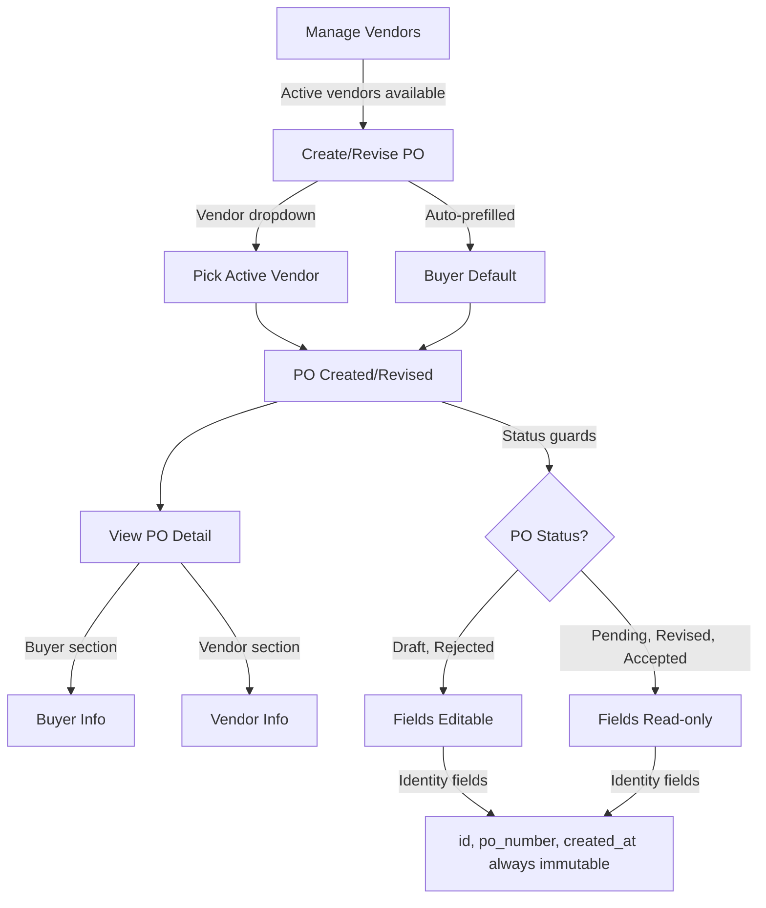

# Iteration 03 — 2026-03-17

## Context

1. Vendor is a separate entity: id (UUID), name, country, active/inactive status. Own table, CRUD API, management UI.
2. PO form picks vendor from a dropdown of Active vendors. Replaces free-text `vendor_id`.
3. Buyer is a prefilled default (name, country) on the PO. Inline fields, not a separate entity yet.
4. PO detail view shows both buyer and vendor sections.
5. PO field immutability: `id`, `po_number`, `created_at` are always immutable. All other fields are mutable only in Draft and Rejected.

## Jobs to Be Done

1. **When** I manage vendors, **I want to** create, list, and deactivate them, **so that** I have a controlled set of vendors to assign to POs.

2. **When** I create or revise a PO, **I want to** pick a vendor from a dropdown of Active vendors, **so that** POs reference consistent vendor data instead of free text.

3. **When** I create a PO, **I want to** see buyer name and country prefilled, **so that** both parties appear on the PO without manual entry.

4. **When** I view a PO, **I want to** see buyer and vendor details in separate sections, **so that** both parties to the order are visible.

5. **When** a PO is in Pending, Revised, or Accepted status, **I want** all fields to be read-only, **so that** data cannot be changed outside Draft and Rejected states.

6. **When** I try to modify `id`, `po_number`, or `created_at`, **I want** the system to reject the change, **so that** identity fields are never overwritten.

### Job Flow

## Acceptance Criteria

### 1. Vendor CRUD
- Vendor has id (UUID, system-generated), name (required, non-empty), country (required), status (Active/Inactive)
- Create vendor returns Active by default
- List vendors supports filtering by status
- Deactivate sets status to Inactive; no hard delete
- Duplicate vendor names are allowed (different entities may share a name)

### 2. Vendor on PO
- PO creation requires a vendor_id referencing an existing Active vendor
- PO revision accepts a new vendor_id; must be Active
- Creating a PO with a nonexistent or Inactive vendor is rejected
- PO stores vendor_id as a reference; vendor name and country are resolved on read

### 3. Buyer on PO
- PO has buyer_name and buyer_country fields
- PO form prefills buyer_name and buyer_country with a default value
- User can see buyer fields but does not select from a list
- Buyer fields are stored inline on the PO

### 4. PO Detail — Both Parties
- Detail view shows a Buyer section (name, country)
- Detail view shows a Vendor section (name, country, resolved from vendor_id)
- List view shows vendor name instead of raw vendor_id

### 5. Field Immutability
- `id`, `po_number`, `created_at` cannot be changed after creation
- All other fields are editable only in Draft and Rejected status
- API rejects updates to POs in Pending, Revised, or Accepted status (409)
- Domain model enforces immutability; not just API-level guards

### 6. Backward Compatibility
- Existing POs with free-text vendor_id are migrated: a Vendor record is created for each unique vendor_id value
- Migration runs at app startup alongside schema changes

## Tasks

### Backend — Vendor Domain
- [x] Define VendorStatus enum (Active, Inactive)
- [x] Define Vendor entity (id, name, country, status, created_at, updated_at)
- [x] Enforce invariants: name required and non-empty, country required

### Backend — Vendor Persistence
- [x] Create `vendors` table schema
- [x] Implement Vendor repository: create, get by id, list with status filter, deactivate
- [x] Migration: create Vendor records from existing distinct vendor_id values on POs
- [x] Wire schema migration into app startup

### Backend — Vendor API
- [x] POST `/api/v1/vendors` — create vendor
- [x] GET `/api/v1/vendors` — list vendors, optional status filter
- [x] GET `/api/v1/vendors/{id}` — get vendor by id
- [x] POST `/api/v1/vendors/{id}/deactivate` — set Inactive

### Backend — PO Domain Changes
- [x] Replace `vendor_id: str` with reference to Vendor entity (validate on create/revise)
- [x] Add `buyer_name` and `buyer_country` fields to PurchaseOrder
- [x] Make `id`, `po_number`, `created_at` read-only properties
- [x] Domain-level guard: `revise()` and field mutation rejected unless Draft or Rejected

### Backend — PO Persistence Changes
- [x] Add `buyer_name`, `buyer_country` columns to `purchase_orders` table
- [x] Update PO repository to join vendor name/country on read

### Backend — PO API Changes
- [x] PO create/update DTOs accept vendor_id (UUID), buyer_name, buyer_country
- [x] PO response DTOs include vendor_name, vendor_country (resolved), buyer_name, buyer_country
- [x] API validates vendor_id references an Active vendor on create and revise

### Frontend — Vendor Management (`/vendors`)
- [x] Vendor list page: name, country, status, deactivate button
- [x] Create vendor form: name, country
- [x] Nav link to /vendors

### Frontend — PO Form Changes
- [x] Replace vendor_id text input with dropdown of Active vendors
- [x] Add buyer_name and buyer_country fields, prefilled with defaults
- [x] Dropdown fetches from GET `/api/v1/vendors?status=ACTIVE`

### Frontend — PO Detail Changes
- [x] Buyer section: name, country
- [x] Vendor section: name, country (from resolved vendor data)
- [x] List view shows vendor name instead of vendor_id

### Frontend — Field Immutability
- [x] Edit button only visible in Draft and Rejected states (already done)
- [x] Verify no UI path allows editing Pending, Revised, or Accepted POs

### Permanent Tests — Backend (85 passing)
- [x] Vendor created with Active status, UUID id
- [x] Vendor creation rejects empty name
- [x] Vendor deactivation sets Inactive
- [x] List vendors filters by status
- [x] PO creation with valid Active vendor succeeds
- [x] PO creation with Inactive vendor fails
- [x] PO creation with nonexistent vendor fails
- [x] PO revision with new Active vendor succeeds
- [x] PO revision with Inactive vendor fails
- [x] Buyer fields stored and returned on PO
- [x] Identity fields (id, po_number, created_at) immutable after creation
- [x] API rejects PO update in Pending/Revised/Accepted status (409)
- [x] Migration creates Vendor records from existing PO vendor_id values

### Permanent Tests — Frontend (17 passing)
- [x] PO list loads and displays vendor names
- [x] PO form uses vendor dropdown
- [x] PO detail shows buyer and vendor sections
- [x] Full lifecycle with vendor dropdown
- [x] Vendor list loads and displays vendors
- [x] Create vendor form works
- [x] Deactivate vendor updates status
- [x] PO form prefills buyer fields

### Scratch Tests (`frontend/tests/scratch/iteration-03/`)
- [x] Screenshot: Vendor list page
- [x] Screenshot: Create vendor form
- [x] Screenshot: PO form with vendor dropdown and buyer fields
- [x] Screenshot: PO detail with buyer and vendor sections

### Reference Data — Exhaustive Payment Terms
- [x] Expand `PAYMENT_TERMS` in `reference_data.py` from 4 entries (DA, DP, LC, TT) to 17 entries covering advance (ADV, CIA, COD), net terms (NET15/30/45/60/90/120), early-payment discount (2NET30), documentary trade (DA, DP, LC, SBLC, TT), and open account (OA, CONSIGN)
- [x] Backend validation (`VALID_PAYMENT_TERMS` frozenset) auto-derives from tuple; no separate change needed
- [x] Backend label resolution (`reference_labels.py`) auto-derives from tuple; no separate change needed
- [x] Frontend dropdown (`POForm.svelte`) fetches from `/api/v1/reference-data/`; no separate change needed
- [x] Update DDD vocab: Payment Terms definition expanded to list all categories

## Notes

Vendor was promoted from a free-text string to a separate entity with UUID identity, name, country, and active/inactive status. PO creation and revision now validate that the referenced vendor exists and is active. Buyer is inline on the PO (name + country) with a hardcoded default, not a separate entity yet. Identity fields (id, po_number, created_at) are enforced as read-only via Python properties. A startup migration converts existing free-text vendor_id values into proper Vendor records. The vendor dropdown replaced the free-text input on the PO form, and the PO detail view now shows separate Buyer and Vendor sections.
